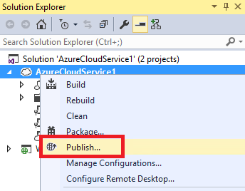

<properties 
   pageTitle="Uso de escritorio remoto con las funciones de Azure | Microsoft Azure"
   description="Uso de escritorio remoto con las funciones de Azure"
   services="visual-studio-online"
   documentationCenter="na"
   authors="TomArcher"
   manager="douge"
   editor="" />
<tags 
   ms.service="multiple"
   ms.devlang="multiple"
   ms.topic="article"
   ms.tgt_pltfrm="na"
   ms.workload="na"
   ms.date="08/15/2016"
   ms.author="tarcher" />

# Uso de escritorio remoto con las funciones de Azure

Mediante el SDK de Azure y servicios de escritorio remoto, puede acceder a las funciones de Azure y máquinas virtuales que se hospedan en Azure. En Visual Studio, puede configurar los servicios de escritorio remoto de un proyecto de Azure. Para habilitar servicios de escritorio remoto, debe crear un proyecto de trabajo que contiene una o varias funciones y, después, publicarlo en Azure.

>[AZURE.IMPORTANT] Debe tener acceso a un rol de Azure para solucionar problemas o desarrollo únicamente. El propósito de cada máquina virtual es ejecutar una función específica en la aplicación de Azure, no para ejecutar otras aplicaciones de cliente. Si desea utilizar Azure para hospedar una máquina virtual que puede usar para cualquier propósito, vea obtener acceso a máquinas virtuales de Azure del explorador de servidores.

## Habilitar y usar Escritorio remoto para un rol de Azure

1. En el Explorador de soluciones, abra el menú contextual para el proyecto y, a continuación, elija **Publicar**.

    Aparece el Asistente para **Publicar aplicaciones de Azure** .

    

1. En la parte inferior de la página de **Configuración de publicación de Microsoft Azure** del asistente, seleccione **Habilitar Escritorio remoto** para la casilla de verificación de todas las funciones. 

    Aparece el cuadro de diálogo **Configuración de escritorio remoto** .

1. En la parte inferior del cuadro de diálogo **Configuración de escritorio remoto** , elija el botón **Más opciones** . 
 
    Muestra un cuadro de lista desplegable que le permite crear o seleccionar un certificado para que puede cifrar la información de credenciales al conectarse a través de escritorio remoto.

1. En la lista desplegable, elija ** &lt;crear >**, o elija uno existente en la lista. 

    Si elige un certificado existente, omita los pasos siguientes.

    >[AZURE.NOTE] Los certificados que necesita para una conexión a Escritorio remoto son diferentes de los certificados que se usa para otras operaciones de Azure. El certificado de acceso remoto debe tener una clave privada.

    Aparece el cuadro de diálogo **Crear certificado** .

    1. Proporcione un nombre descriptivo para el nuevo certificado y, a continuación, elija el botón **Aceptar** . El nuevo certificado aparece en el cuadro de lista desplegable.

    1. En el cuadro de diálogo **Configuración de escritorio remoto** , proporcione un nombre de usuario y una contraseña.
    
        No puede usar una cuenta existente. No especifique Administrador como nombre de usuario para la nueva cuenta.

        >[AZURE.NOTE] Si la contraseña no cumple los requisitos de complejidad, aparece un icono de color rojo junto al cuadro de texto de contraseña. La contraseña debe incluir letras mayúsculas, minúsculas y números o símbolos.

    1. Elija una fecha en la que va a expirar la cuenta y después se bloquearán las conexiones de escritorio remotos.

    1. Una vez que haya proporcionado toda la información necesaria, elija el botón **Aceptar** .
    
        Varias opciones que permiten servicios de acceso remoto se agregan a los archivos .cscfg y .csdef.

1. En el Asistente de **Configuración de publicación de Microsoft Azure** , elija el botón **Aceptar** cuando esté listo para publicar su servicio de nube.

    Si no está listo para publicar, elija el botón **Cancelar** . Se guardan los valores de configuración, y puede publicar su servicio de nube más adelante.

## Conectarse a un rol de Azure mediante Escritorio remoto

Después de publicar su servicio de nube en Azure, puede usar el Explorador de servidores para iniciar sesión en los equipos virtuales que hospeda Azure. 

1. En el Explorador de servidor, expanda el nodo de **Azure** y, a continuación, expanda el nodo de un servicio de nube y uno de sus funciones para mostrar una lista de instancias.

1. Abrir el menú contextual de un nodo de la instancia y, a continuación, elija **Conectar utilizando Escritorio remoto**.

    

1. Escriba el nombre de usuario y la contraseña que ha creado previamente. Ha iniciado sesión en el equipo remoto.

