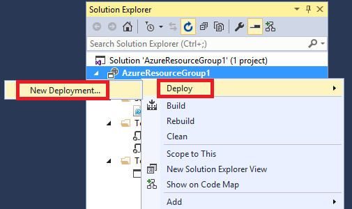
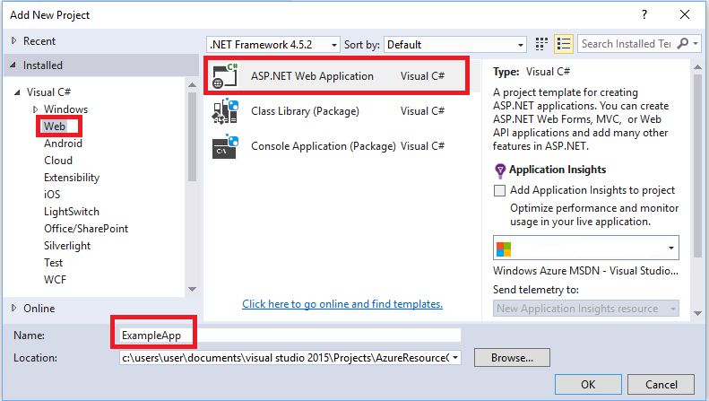
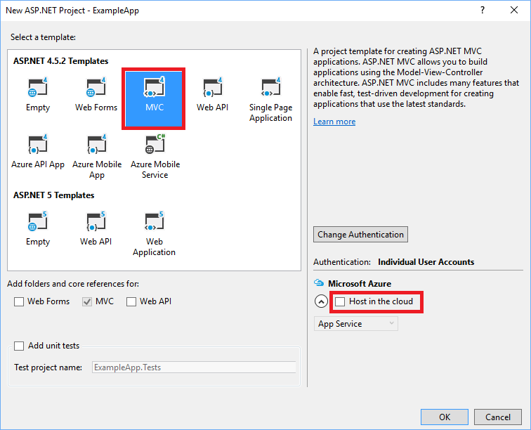

<properties
   pageTitle="Proyectos de Visual Studio de grupo de recursos de Azure | Microsoft Azure"
   description="Use Visual Studio para crear un proyecto del grupo de recursos de Azure e implementar los recursos en Azure."
   services="azure-resource-manager"
   documentationCenter="na"
   authors="tfitzmac"
   manager="timlt"
   editor="tysonn" />
<tags
   ms.service="azure-resource-manager"
   ms.devlang="multiple"
   ms.topic="get-started-article"
   ms.tgt_pltfrm="na"
   ms.workload="na"
   ms.date="09/20/2016"
   ms.author="tomfitz" />

# Crear e implementar grupos de recursos de Azure a través de Visual Studio

Con Visual Studio y el [SDK de Azure](https://azure.microsoft.com/downloads/), puede crear un proyecto que implemente la infraestructura y el código en Azure. Por ejemplo, puede definir el host de web, el sitio web y la base de datos de la aplicación e implementar esa infraestructura junto con el código. O bien, puede definir una máquina Virtual, una red Virtual y cuenta de almacenamiento e implementar esa infraestructura junto con una secuencia de comandos que se ejecuta en la máquina Virtual. El proyecto de implementación de **Grupo de recursos de Azure** le permiten implementar todos los recursos necesarios en una operación única, puede repetir. Para obtener más información sobre cómo implementar y administrar los recursos, vea [información general del Administrador de recursos de Azure](azure-resource-manager/resource-group-overview.md).

Proyectos de grupo de recursos de Azure contienen plantillas de Azure Administrador de recursos JSON, que definen los recursos que se implementación en Azure. Para obtener información sobre los elementos de la plantilla de administrador de recursos, consulte [plantillas de administrador de recursos de Azure de creación](resource-group-authoring-templates.md). Visual Studio permite editar estas plantillas y proporciona herramientas que simplifican el trabajo con plantillas.

En este tema, implemente una aplicación web y base de datos de SQL. Sin embargo, los pasos son casi el mismo para cualquier tipo de recurso. Puede como implementar fácilmente una máquina Virtual y los recursos relacionados. Visual Studio proporciona muchas plantillas iniciales diferentes para implementar escenarios comunes.

Este artículo le muestra 2 de actualización de Visual Studio 2015 y Microsoft Azure SDK para .NET 2,9. Si usa 2013 de Visual Studio con Azure SDK 2,9, su experiencia es prácticamente la misma. Puede usar las versiones de Azure SDK desde 2.6 o posterior; Sin embargo, la experiencia de la interfaz de usuario puede ser diferente de la interfaz de usuario que se muestra en este artículo. Le recomendamos que instale la última versión de [Azure SDK](https://azure.microsoft.com/downloads/) antes de iniciar los pasos. 

## Proyecto de crear un grupo de recursos de Azure

En este procedimiento, se crea un proyecto del grupo de recursos de Azure con una plantilla de **aplicación Web + SQL** .

1. En Visual Studio, elija **archivo**, **Nuevo proyecto**, elija **Visual Basic**o **C#** . A continuación, elija la **nube**y, a continuación, elija proyecto del **Grupo de recursos de Azure** .

    

1. Elija la plantilla que desea implementar para el Administrador de recursos de Azure. Observe que hay muchas opciones diferentes basadas en el tipo de proyecto que desea implementar. En este tema, elija la plantilla de **aplicación Web + SQL** .

    

    La plantilla que elija es simplemente un punto de partida; Puede agregar y quitar recursos para cumplir con su situación.

    >[AZURE.NOTE] Visual Studio recupera una lista de plantillas disponibles en línea. Puede cambiar la lista.

    Visual Studio crea un proyecto de implementación de grupo de recursos para la aplicación web y base de datos SQL.

1. Para ver lo que ha creado, expanda los nodos del proyecto de implementación.

    

    Dado que elegimos la aplicación Web + plantilla SQL en este ejemplo, verá los archivos siguientes: 

  	|Nombre de archivo|Descripción|
  	|---|---|
  	|AzureResourceGroup.ps1 implementar|Un script de PowerShell que invoca comandos de PowerShell para implementar para el Administrador de recursos de Azure. **Nota** Visual Studio utiliza esta secuencia de comandos de PowerShell para implementar la plantilla. Los cambios que realice en esta secuencia de comandos afectan a la implementación en Visual Studio, así que tenga cuidado.|
  	|WebSiteSQLDatabase.json|La plantilla de administrador de recursos que define la infraestructura que desee implementar en Azure y los parámetros que puede proporcionar durante la implementación. También define las dependencias entre los recursos para que Administrador de recursos implementa los recursos en el orden correcto.|
  	|WebSiteSQLDatabase.parameters.json|Un archivo de parámetros que contiene los valores necesarios en la plantilla. Pasar de valores de parámetro para personalizar cada implementación.|

    Todos los proyectos de implementación de grupo de recursos contienen estos archivos básicos. Otros proyectos pueden contener archivos adicionales para admitir otras funciones.

## Personalizar la plantilla de administrador de recursos

Puede personalizar un proyecto de implementación modificando las plantillas JSON que describen los recursos que desea distribuir. JSON significa notación de objetos JavaScript y es un formato de número de serie de datos que sea fácil trabajar con. Los archivos JSON usan un esquema a los que se hace referencia en la parte superior de cada archivo. Si desea comprender el esquema, puede descargar y analizar. El esquema define qué elementos son válidos, los tipos y formatos de campos, los valores posibles de los valores enumerados y así sucesivamente. Para obtener información sobre los elementos de la plantilla de administrador de recursos, consulte [plantillas de administrador de recursos de Azure de creación](resource-group-authoring-templates.md).

Para trabajar en la plantilla, abra **WebSiteSQLDatabase.json**.

El editor de Visual Studio proporciona herramientas para ayudarle con la edición de la plantilla de administrador de recursos. La ventana de **Esquema JSON** facilita la verán los elementos que se definen en la plantilla.

Seleccionar cualquiera de los elementos en el esquema le lleva a la parte de la plantilla y resalta el JSON correspondiente.

Puede agregar un recurso seleccionando el botón **Agregar recurso** en la parte superior de la ventana de esquema de JSON, o haciendo clic en **recursos** y seleccionando **Agregar nuevo recurso**.

En este tutorial, seleccione la **Cuenta de almacenamiento** y asígnele un nombre. Proporcione un nombre de no más de 11 caracteres, y sólo contiene números y letras minúsculas.

Observe que fue el recurso agregado, pero también un parámetro para la cuenta de almacenamiento de tipo y una variable para el nombre de la cuenta de almacenamiento.

El parámetro **storageType** está predefinido con los tipos permitidos y un tipo predeterminado. Puede dejar estos valores o modificarlos para su situación. Si no desea que todos los usuarios a implementar una cuenta de almacenamiento **Premium_LRS** a través de esta plantilla, puede quitar de los tipos permitidos. 

    "storageType": {
      "type": "string",
      "defaultValue": "Standard_LRS",
      "allowedValues": [
        "Standard_LRS",
        "Standard_ZRS",
        "Standard_GRS",
        "Standard_RAGRS"
      ]
    }

Visual Studio también proporciona intellisense para ayudarle a entender qué propiedades están disponibles al editar la plantilla. Por ejemplo, para editar las propiedades de su plan de servicios de aplicación, vaya al recurso **HostingPlan** y agregue un valor para las **Propiedades**. Observe que intellisense muestra los valores disponibles y proporciona una descripción de dicho valor.

Puede establecer **numberOfWorkers** en 1.

    "properties": {
      "name": "[parameters('hostingPlanName')]",
      "numberOfWorkers": 1
    }

## Implemente el proyecto de grupo de recursos en Azure

Ya está listo para implementar el proyecto. Cuando se implementa un proyecto del grupo de recursos de Azure, se implementa en un grupo de recursos de Azure. El grupo de recursos es una agrupación lógica de recursos que comparten un ciclo de vida comunes.

1. En el menú contextual del nodo de proyecto de implementación, elija **implementar** > **Implementación de nuevo**.

    

    Aparece el cuadro de diálogo **implementar al grupo de recursos** .

    

1. En el cuadro de lista desplegable **grupo de recursos** , elija un grupo de recursos existente o cree uno nuevo. Para crear un grupo de recursos, abra el cuadro de lista desplegable de **Grupo de recursos** y elija **Crear nueva**.

    

    Aparece el cuadro de diálogo **Crear grupo de recursos** . Darle al grupo un nombre y una ubicación y a continuación, seleccione el botón **crear** .

    
   
1. Editar los parámetros para la implementación seleccionando el botón **Editar parámetros** .

    

1. Proporcionar los valores para los parámetros vacíos y seleccione el botón **Guardar** . Los parámetros vacíos son **hostingPlanName**, **administratorLogin**, **administratorLoginPassword**y **databaseName**.

    **hostingPlanName** especifica un nombre para el [plan de servicios de aplicación](./app-service/azure-web-sites-web-hosting-plans-in-depth-overview.md) crear. 
    
    **administratorLogin** especifica el nombre de usuario para el Administrador de SQL Server. No use nombres de administración comunes como **sa** o **Administrador**. 
    
    El **administratorLoginPassword** especifica una contraseña de administrador de SQL Server. La opción **Guardar contraseñas como texto sin formato en el archivo de parámetros** no está segura; por lo tanto, no seleccione esta opción. Puesto que la contraseña no se guarda como texto sin formato, debe proporcionar esta contraseña durante la implementación. 
    
    **databaseName** especifica un nombre para la base de datos crear. 

    
    
1. Seleccione el botón de **implementar** para implementar el proyecto en Azure. Se abre una consola de PowerShell fuera de la instancia de Visual Studio. En la consola de PowerShell cuando se le pida, escriba la contraseña de administrador de SQL Server. **La consola de PowerShell puede ser oculta detrás de otros elementos o minimizada en la barra de tareas.** Busque esta consola y selecciónela para proporcionar la contraseña.

    >[AZURE.NOTE] Visual Studio puede pedirle que instale los cmdlets de PowerShell de Azure. Necesita los cmdlets de PowerShell de Azure para implementar grupos de recursos. Si se le solicita, instálelas.
    
1. La implementación puede tardar unos minutos. En la ventana de **salida** , vea el estado de la implementación. Cuando haya terminado la implementación, el último mensaje indica una implementación correcta algo similar a:

        ... 
        18:00:58 - Successfully deployed template 'c:\users\user\documents\visual studio 2015\projects\azureresourcegroup1\azureresourcegroup1\templates\websitesqldatabase.json' to resource group 'DemoSiteGroup'.

1. En un explorador, abra el [portal de Azure](https://portal.azure.com/) e inicie sesión con su cuenta. Para ver el grupo de recursos, seleccione **grupos de recursos** e implementa en el grupo de recursos.

    

1. Ver todos los recursos implementados. Observe que el nombre de la cuenta de almacenamiento no es exactamente lo que especificó al agregar ese recurso. La cuenta de almacenamiento debe ser única. La plantilla agrega automáticamente una cadena de caracteres para el nombre proporcionado para proporcionar un nombre único. 

    

1. Si realiza cambios y desea volver a implementar el proyecto, elija el grupo de recursos existente en el menú contextual del proyecto del grupo de recursos de Azure. En el menú contextual, elija **implementar**y, a continuación, elija el grupo de recursos que implementa.

    

## Implementar código con su infraestructura

En este momento, ha implementado la infraestructura de la aplicación, pero no hay ningún código real implementado con el proyecto. Este tema muestra cómo implementar una aplicación web y tablas de base de datos SQL durante la implementación. Si va a implementar una máquina Virtual en lugar de una aplicación web, en el que desea ejecutar el código en el equipo como parte de la implementación. El proceso de implementación de código para una aplicación web o para configurar una máquina Virtual es prácticamente el mismo.

1. Agregar un proyecto a la solución de Visual Studio. Haga clic en la solución y a continuación, seleccione **Agregar** > **Nuevo proyecto**.

    

1. Agregar una **aplicación Web de ASP.NET**. 

    
    
1. Seleccione **MVC** y desactive el campo de **Host en la nube** porque el proyecto del grupo de recursos realiza dicha tarea.

    
    
1. Después de que Visual Studio crea la aplicación web, vea ambos proyectos en la solución.

    

1. Ahora, debe asegurarse de que el proyecto del grupo de recursos tiene constancia del nuevo proyecto. Vuelva a su proyecto del grupo de recursos (AzureResourceGroup1). Haga clic en **referencias** y seleccione **Agregar referencia**.

    

1. Seleccione el proyecto de aplicación web que ha creado.

    
    
    Agregando una referencia, vincular el proyecto de aplicación web para el proyecto del grupo de recursos y configurar automáticamente tres propiedades clave. Consulte estas propiedades en la ventana de **Propiedades** de la referencia.

      
    
    Las propiedades son:

    - Las **Propiedades adicionales** contiene el paquete de implementación web provisional ubicación a la que se inserta en el almacenamiento de Azure. Tenga en cuenta la carpeta (ExampleApp) y archivo (package.zip). Le proporcionará estos valores como parámetros al implementar la aplicación. 
    - La **Inclusión ruta de acceso del archivo** contiene la ruta de acceso donde se creó el paquete. Los **Destinos incluir** contiene el comando que se ejecuta la implementación. 
    - El valor predeterminado de **Generar; Paquete** permite la implementación diseñar y crear un paquete de implementación web (package.zip).  
    
    No es necesario un perfil de publicación como la implementación obtiene la información necesaria de las propiedades para crear el paquete.
      
1. Agregar un recurso a la plantilla.

    

1. Esta vez seleccione **Web implementar para las aplicaciones Web**. 

    
    
1. Redistribuir el proyecto del grupo de recursos al grupo de recursos. En este momento, hay algunos parámetros nuevos. No debe proporcionar los valores para **_artifactsLocation** o **_artifactsLocationSasToken** porque Visual Studio genera automáticamente esos valores. Sin embargo, tendrá que configurar la carpeta y el nombre de archivo para la ruta de acceso que contiene el paquete de implementación (se muestra como **ExampleAppPackageFolder** y **ExampleAppPackageFileName** en la siguiente imagen). Proporcionar los valores que ha visto anteriormente en las propiedades de referencia (**ExampleApp** y **package.zip**).

    
    
    Para la **cuenta de almacenamiento de muestra**, seleccione el implementado con este grupo de recursos.
    
1. Cuando haya finalizado la implementación, seleccione la aplicación web en el portal. Seleccione la dirección URL para explorar el sitio.

    

1. Observe que ha implementado correctamente la aplicación ASP.NET predeterminada.

    

## Pasos siguientes

- Para obtener información sobre la administración de los recursos a través del portal, consulte [con el portal de Azure para administrar los recursos de Azure](./azure-portal/resource-group-portal.md).
- Para obtener más información sobre las plantillas, vea [plantillas de administrador de recursos de Azure de creación](resource-group-authoring-templates.md).
