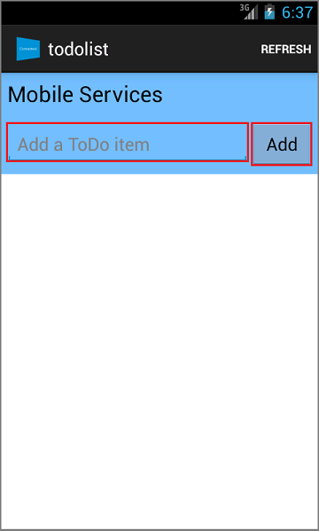

1. Visite el [Portal de Azure]. Haga clic en **Examinar todos** > **Aplicaciones Mobile** > el back-end que acaba de crear. En la configuración de la aplicación móvil, haga clic en **Tutorial rápido** > **Android)**. **Configurar la aplicación cliente**, haga clic en **Descargar**. Esto descarga un proyecto completo Android para una aplicación preconfigurado para conectarse a su back-end. 

2. Abra el proyecto mediante **Studio Android**, utilizando **el proyecto de importación (ADT Eclipse, Gradle, etc.)**. Asegúrese de que realice esta selección de importación para evitar los errores JDK.

3. Presione el botón **ejecutar 'app'** para generar el proyecto e inicie la aplicación en el simulador Android.

4. En la aplicación, escriba el texto descriptivo, como _completado el tutorial_ y, a continuación, haga clic en el botón 'Agregar'. Envía una petición POST a Azure copia back-end que ha implementado una versión anterior. Los datos de inserciones de back-end de la solicitud está en la tabla de SQL TodoItem y devuelve información acerca de los elementos recién almacenados volver a la aplicación móvil. La aplicación móvil muestra estos datos en la lista. 

    

[Portal de Azure]: https://portal.azure.com/
