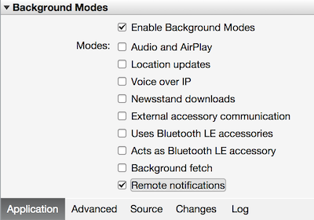

####Configurar el proyecto de iOS en Xamarin Studio

1. Xamarin.Studio, abra **Info.plist**y actualizar el **Identificador de paquete** con el identificador de paquete que creó anteriormente con su nuevo identificador de aplicación.

    

2. Desplácese hacia abajo hasta **Modos de fondo** y Active la casilla **Habilitar los modos de fondo** y el cuadro **notificaciones remotas** . 

    

3. Haga doble clic en el proyecto en el Panel de soluciones para abrir **Opciones de proyecto**.

4.  Elija **iOS paquete firma** en **Generar**y seleccione la correspondiente **identidad** y el **perfil de aprovisionamiento** simplemente había configurado para este proyecto. 

    

    Así se garantiza que el nuevo perfil utiliza el proyecto para firmar el código. Oficial Xamarin dispositivo de aprovisionamiento de documentación, consulte [Xamarin aprovisionamiento de dispositivos].

####Configurar el proyecto de iOS en Visual Studio

1. En Visual Studio, haga clic en el proyecto y, a continuación, haga clic en **Propiedades**.

2. En las páginas de propiedades, haga clic en la pestaña de la **aplicación de iOS** y actualizar el **identificador** con el identificador que creó anteriormente.

    

3. En la pestaña **iOS firma del paquete** , seleccione la correspondiente **identidad** y **perfil de aprovisionamiento** simplemente había configurado para este proyecto. 

    

    Así se garantiza que el nuevo perfil utiliza el proyecto para firmar el código. Oficial Xamarin dispositivo de aprovisionamiento de documentación, consulte [Xamarin aprovisionamiento de dispositivos].

4. Haga doble clic en Info.plist para abrirla y, a continuación, habilitar **RemoteNotifications** en los modos de fondo. 

[Dispositivo Xamarin de aprovisionamiento]: http://developer.xamarin.com/guides/ios/getting_started/installation/device_provisioning/