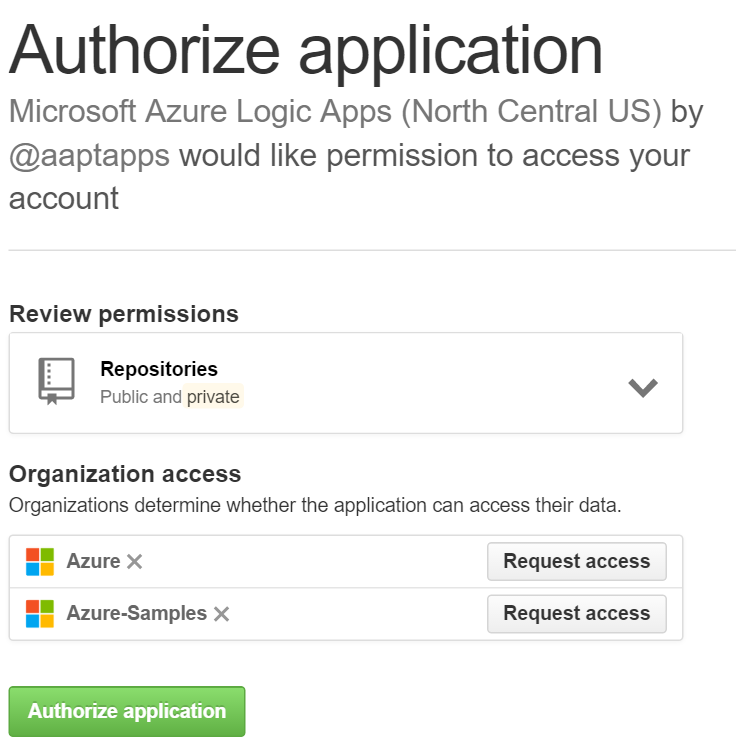

### Requisitos previos
- Una cuenta de [GitHub](http://GitHub.com) 

Para poder usar su cuenta de GitHub en una aplicación de lógica, debe autorizar la aplicación de lógica para conectarse a su cuenta de GitHub. Afortunadamente, puede hacerlo fácilmente desde dentro de la aplicación de lógica en el Portal de Azure. 

Estos son los pasos para autorizar su aplicación lógica para conectarse a su cuenta de GitHub:

1. Para crear una conexión a GitHub, en el Diseñador de lógica aplicación, seleccione **Mostrar Microsoft managed API** en la lista desplegable, a continuación, escriba *GitHub* en el cuadro de búsqueda. Seleccione la acción que desea utilizar o el desencadenador:  
  
2. Si todavía no lo ha creado todas las conexiones a GitHub antes, obtener le pedirá que proporcione sus credenciales de GitHub. Estas credenciales se usará para autorizar su aplicación lógica para conectarse a y tener acceso a datos de la cuenta de GitHub:  
  
3. Proporcionar su GitHub nombre de usuario y contraseña para autorizar la aplicación de lógica:  
     
4. Confirme sus intenciones:  
     
5. Observe que la conexión se ha creado en el portal. Ahora puede continuar con la aplicación de la lógica de crear y usar GitHub en él:   
     
