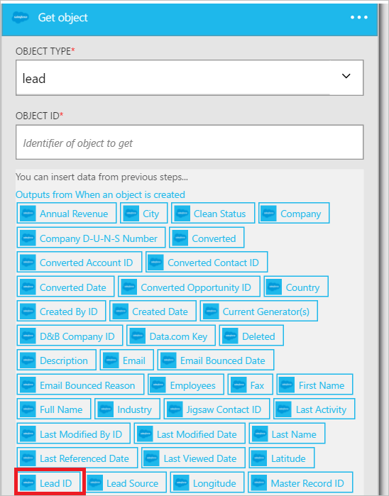
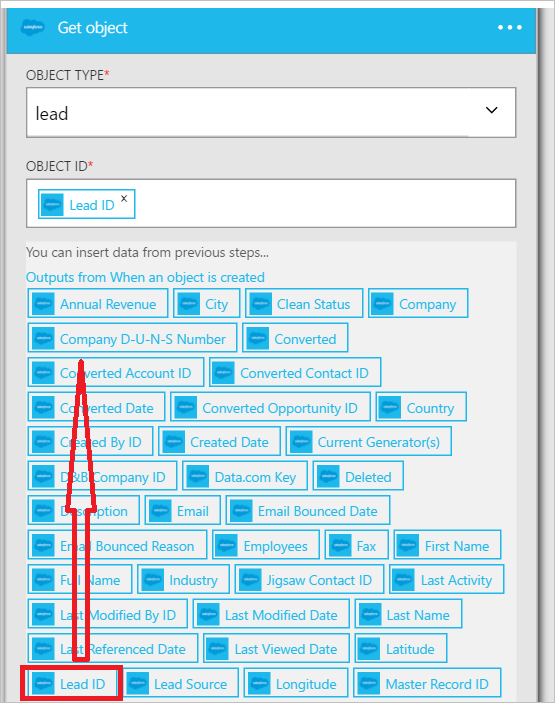
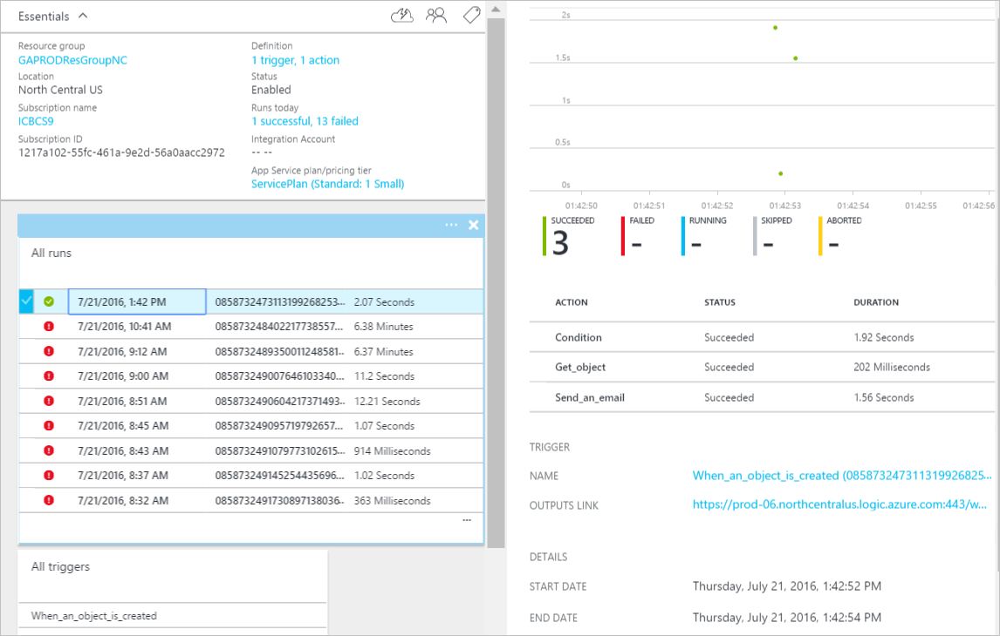

Ahora que ha agregado una condición, su tiempo de hacer algo interesante con los datos que se generan el desencadenador. Siga estos pasos para agregar la acción de **Salesforce - obtener el objeto** . Esta acción obtendrán los datos cada vez que se crea un nuevo cliente potencial. También se agregará una segunda acción que usará los datos de la división de ventas - obtener una acción de objeto para enviar un correo electrónico usando el conector de Office 365.  

Para configurar esta acción, deberá proporcionar la siguiente información. Verá que es fácil de usar datos generados por el desencadenador como entrada para algunas de las propiedades para el nuevo archivo:

|Crear propiedades de archivo|Descripción|
|---|---|
|Tipo de objeto|Esto es el tipo de objeto de Salesforce que le interesa. Algunos ejemplos son cliente potencial, cuenta, etcetera.|
|Identificador de objeto|Esto representa un identificador para el objeto.|

1. Seleccione el vínculo **Agregar una acción** . Se abre el cuadro de búsqueda donde puede buscar cualquier acción le gustaría tener. En este ejemplo, las acciones de Salesforce son de interés.      
  
- Escriba *salesforce* para buscar acciones de salesforce.
- Seleccione **Salesforce - obtener el objeto** como la acción que se ejecuta.   **Nota**: se le pedirá para autorizar su aplicación lógica para acceder a su cuenta de Salesforce si no ha hecho previamente.    
    
- Se abre el control de **obtener el objeto** .  
- Seleccione el *cliente potencial* como el tipo de objeto.
- Seleccione el control de **Identificador de objeto** .
- Seleccione **...** para expandir la lista de símbolos que se pueden usar como entrada para acciones.       
    
- Seleccione control de **Identificador de cliente potencial** se abre.   
     
- Observe que el token de identificador del cliente potencial se encuentra ahora en el control de identificador de objeto, que indica que la acción de objeto obtener buscará para un cliente potencial con un identificador que es igual que el identificador de cliente potencial de cliente potencial que activó esta aplicación lógica.  
  
- Guarde su trabajo. Eso es todo, la acción de objeto Get que haya agregado a su aplicación lógica. El control de objeto Get debe tener este aspecto:    
  

Ahora que ha agregado una acción para obtener un cliente potencial, desea hacer algo interesante con el cliente potencial recién creado. En una empresa desea enviar un correo electrónico para notificar a una lista de distribución que se ha creado un nuevo cliente potencial. Vamos a usar el conector de Office 365 para enviar un correo electrónico con la información pertinente desde el objeto de cliente potencial de Salesforce.  

1. Seleccione **Agregar una acción** , a continuación, escriba el *correo electrónico* en el control de búsqueda. Esto filtra las acciones a las que están relacionadas a enviar y recibir correo electrónico.  
- Seleccione el elemento de lista de **Office 365 Outlook: enviar un correo electrónico** . Si no ha creado una *conexión* a su cuenta de Office 365, se le pedirá que introduzca sus credenciales de Office 365 para crearla ahora. Cuando haya terminado, se abre el control **Enviar un correo electrónico** .        
  
- Escriba la dirección de correo electrónico que desea enviar correo electrónico en el control **a** .
-  En el control de **asunto** , escriba un *nuevo cliente potencial creado* : y seleccione el token de la *compañía* . Esta opción mostrará el campo *empresa* desde el nuevo cliente potencial creado en Salesforce.  
-  En el control de **cuerpo** , puede seleccionar cualquiera de los símbolos del nuevo objeto de cliente potencial y también puede escribir el texto que desea mostrar en el cuerpo del correo electrónico. Aquí tenemos un ejemplo:  
   
- Guardar el flujo de trabajo.  

Eso es todo. La aplicación de lógica está ahora completa.  

Ahora, puede probar la aplicación de lógica: en Salesforce, cree un nuevo cliente potencial que cumpla la condición que creó.  Si ha seguido completamente este tutorial, cree un cliente potencial con una dirección de correo electrónico que contenga *amazon.com* en él. Después de unos segundos debe realizarse la aplicación de la lógica y los resultados pueden tener un aspecto parecidos a este:  
  

