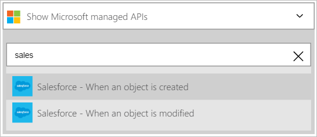
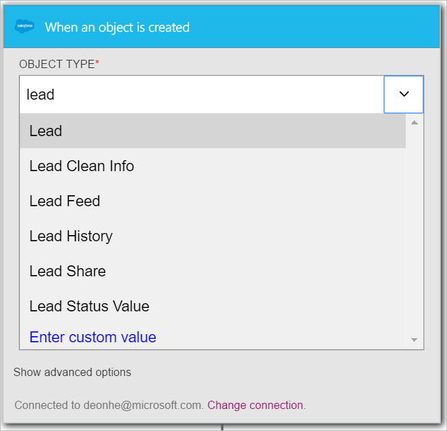

En este tutorial, aprenderá cómo usar el desencadenador de **Salesforce - cuando se crea un objeto** para iniciar un flujo de trabajo de la aplicación lógica cuando se crea un nuevo cliente potencial en su Salesforce.

>[AZURE.NOTE]Obtener le para iniciar sesión en su cuenta de Salesforce si aún no ha creado una *conexión* a Salesforce.  

1. Escriba *salesforce* en el cuadro de búsqueda en el Diseñador de aplicaciones de lógica, a continuación, seleccione el desencadenador de **Salesforce - cuando se crea un objeto** .  
   
- Se muestra el control **cuando se crea un objeto** .  
   
- Seleccione el **Tipo de objeto** , a continuación, seleccione el *cliente potencial* desde la lista de objetos. En este paso se indica que está creando un desencadenador que le notificará la aplicación lógica cuando se cree un nuevo cliente potencial en Salesforce.   
   
- Eso es todo. Ha creado el desencadenador. Sin embargo, debe crear al menos una acción con el fin de hacer una aplicación lógica válida.    
   

En este momento, la aplicación de la lógica se ha configurado con un desencadenador que comience una ejecución de los otros desencadenadores y acciones en el flujo de trabajo cuando se crea un nuevo elemento en su Salesforce.  