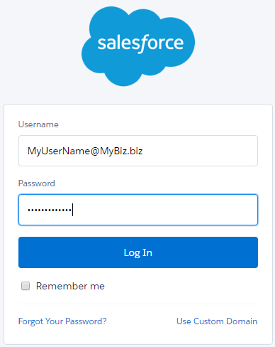

### Requisitos previos

- Una cuenta de [Salesforce](https://salesforce.com)  

Antes de poder usar su cuenta de Salesforce en una aplicación de lógica, debe autorizar la aplicación de lógica para conectarse a su cuenta de Salesforce. Afortunadamente, puede hacerlo fácilmente desde dentro de la aplicación de lógica en el Portal de Azure.  

Estos son los pasos para autorizar su aplicación lógica para conectarse a su cuenta de Salesforce:  
1. Para crear una conexión de Salesforce, en el Diseñador de lógica aplicación, seleccione **Mostrar Microsoft managed API** en la lista desplegable, a continuación, escriba *Salesforce* en el cuadro de búsqueda. Seleccione la acción que desea utilizar o el desencadenador:  
  
2. Si todavía no lo ha creado todas las conexiones a Salesforce antes, obtener le pedirá que proporcione sus credenciales de Salesforce. Estas credenciales se usará para autorizar para conectarse a la aplicación de lógica y tener acceso a datos de la cuenta de Salesforce:  
  
3. Proporcione el nombre de usuario de Salesforce y la contraseña para autorizar la aplicación de lógica:  
   
4. Nos permiten conectarse a Salesforce:  
  
5. Observe la conexión se ha creado y ahora está libre para continuar con el resto de los pasos en su aplicación de lógica:  
  
