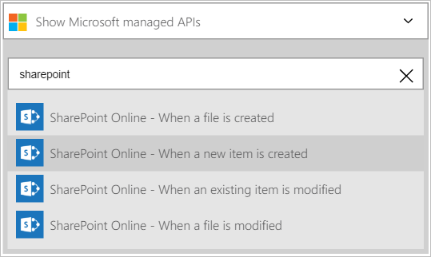
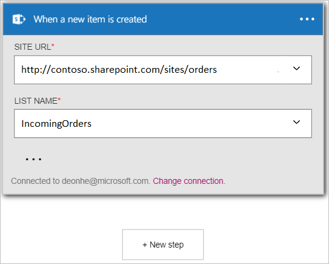

En este ejemplo, le mostrará cómo usar el desencadenador de **SharePoint Online: cuando se crea un nuevo elemento** para iniciar un flujo de trabajo de la aplicación lógica cuando se crea un nuevo elemento en una lista de SharePoint Online.

>[AZURE.NOTE]Obtener le para iniciar sesión en su cuenta de SharePoint si aún no ha creado una *conexión* a SharePoint Online.  

1. Escriba *sharepoint* en el cuadro de búsqueda en el Diseñador de aplicaciones de lógica, a continuación, seleccione el desencadenador de **SharePoint Online: cuando se crea un nuevo elemento** .  
  
- Se muestra el control **cuando se crea un nuevo elemento** .  
   
- Seleccione una **dirección URL del sitio**. Este es el sitio de SharePoint online que desea supervisar para que nuevos elementos desencadenar un flujo de trabajo.  
   
- Seleccione un **nombre de la lista**. Esta es la lista en el sitio de SharePoint Online que desea supervisar para nuevos elementos que se activarán el flujo de trabajo.  
   

En este momento, la aplicación de la lógica se ha configurado con un desencadenador que iniciará una ejecución de los otros desencadenadores y acciones en el flujo de trabajo. Esto producirá cada vez que se crea un nuevo elemento en la lista de SharePoint Online que seleccionó.  