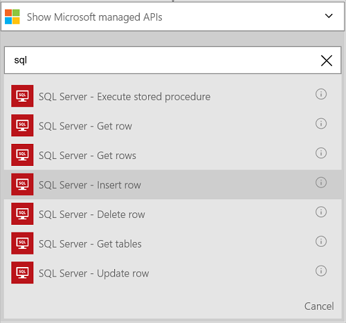

### Requisitos previos
- Una cuenta de Azure puede crear una [cuenta gratuita](https://azure.microsoft.com/free)
- Una [Base de datos de SQL Azure](../articles/sql-database/sql-database-get-started.md) con su información de conexión, incluido el nombre del servidor, el nombre de base de datos y el nombre de usuario y contraseña. Esta información se incluye en la cadena de conexión de base de datos SQL:
  
    Servidor = tcp:*yoursqlservername*. database.windows.net,1433;Initial catálogo =*yourqldbname*; Almacenar información de seguridad = False. Identificador de usuario = {your_username}; Contraseña = {Neptuno}; MultipleActiveResultSets = False. Cifrar = verdadero; TrustServerCertificate = False. Tiempo de espera de conexión = 30;

    Obtenga más información acerca de [Bases de datos de SQL Azure](https://azure.microsoft.com/services/sql-database).

> [AZURE.NOTE] Cuando se crea una base de datos de SQL Azure, también puede crear las bases de datos de ejemplo incluidos con SQL. 

Antes de utilizar la base de datos de SQL Azure en una aplicación de lógica, conectarse a la base de datos de SQL. Puede hacerlo fácilmente dentro de la aplicación de lógica en el portal de Azure.  

Conectarse a la base de datos de SQL Azure con los pasos siguientes:  

1. Crear una aplicación de lógica. En el Diseñador de aplicaciones de lógica, agregar un desencadenador y, a continuación, agregue una acción. Seleccione **Mostrar Microsoft managed API** en la lista desplegable y, a continuación, escriba "sql" en el cuadro de búsqueda. Seleccione una de las acciones:  

    

2. Si todavía no lo ha creado previamente las conexiones a la base de datos de SQL, se le pedirá que especifique los detalles de la conexión:  

     

3. Escriba los detalles de la base de datos de SQL. Propiedades con un asterisco son necesarias.

    | (Propiedad) | Detalles |
|---|---|
| Conectar a través de la puerta de enlace | Dejar esta desactivada. Se utiliza al conectarse a un servidor local SQL Server. |
| Nombre de la conexión * | Escriba un nombre para la conexión. | 
| Nombre de SQL Server * | Escriba el nombre del servidor; que es similar a *servername.database.windows.net*. El nombre del servidor aparece en las propiedades de base de datos SQL en el portal de Azure y también se muestran en la cadena de conexión. | 
| Nombre de la base de datos SQL * | Escriba el nombre que le asignó a la base de datos de SQL. Se muestra en las propiedades de base de datos SQL de la cadena de conexión: catálogo inicial =*yoursqldbname*. | 
| Nombre de usuario * | Escriba el nombre de usuario que creó cuando se creó la base de datos de SQL. Se muestra en las propiedades de base de datos SQL en el portal de Azure. | 
| Contraseña * | Escriba la contraseña creada cuando se creó la base de datos de SQL. | 

    Estas credenciales se utilizan para autorizar su aplicación lógica para conectarse y obtener acceso a los datos SQL. Cuando haya finalizado, los detalles de la conexión un aspecto similares al siguiente:  

     

4. Seleccione **crear**. 

5. Observe que se ha creado la conexión. Ahora, continúe con el resto de los pasos en su aplicación de lógica: 

    