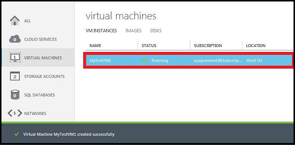

#Cómo crear una máquina Virtual personalizada

Una máquina virtual *personalizada* se refiere a una máquina virtual que se crea usando el método **De la Galería** porque le permite configurar más opciones de que el método de **Creación rápida** . Estas opciones incluyen:

- Más opciones para la imagen usar para crear la máquina virtual (VM)
- La máquina virtual a conectarse a una red virtual
- Agregar la máquina virtual a un servicio de nube existente
- Agregar la máquina virtual a un conjunto de disponibilidad

> [AZURE.IMPORTANT] Si desea que su máquina virtual a utilizar una red virtual para que pueda conectarse a ella directamente por nombre de host o configurar conexiones entre local, asegúrese de que especifique la red virtual cuando se crea la máquina virtual. Puede configurar una máquina virtual para unirse a una red virtual solo cuando se crea la máquina virtual. Para obtener más información acerca de las redes virtuales, vea [Introducción a Azure Virtual de red](http://go.microsoft.com/fwlink/p/?LinkID=294063).

1. Inicie sesión en el [portal de Azure](http://manage.windowsazure.com).

2. En la barra de comandos, haga clic en **nuevo**.

3. Haga clic en **calcular**, haga clic en la **Máquina Virtual**y, a continuación, haga clic en **Desde la Galería**.

4. Elija la imagen que desea usar y, a continuación, haga clic en la flecha para continuar.

5. Si varias versiones de la imagen están disponibles, en **Fecha de lanzamiento de versión**, seleccione la versión que desea usar.

6. En **Nombre de la máquina Virtual**, escriba el nombre que desea usar para la máquina virtual.

7. Use **nivel** y **tamaño** para seleccionar el tamaño adecuado para la máquina virtual. El tamaño que seleccione afecta a la configuración de la máquina virtual, así como el precio máxima. Para obtener más detalles, consulte [Máquina Virtual y los tamaños de servicio de nube para Azure](http://go.microsoft.com/fwlink/p/?LinkID=389844).

8. En el **Nuevo nombre de usuario**, escriba un nombre para la cuenta administrativa que desea usar para administrar el servidor.

9. En la **Nueva contraseña**, escriba una contraseña segura para la cuenta administrativa. En **Confirmar contraseña**, vuelva a escribir la misma contraseña.

10. Haga clic en la flecha para continuar.

11. En el **Servicio de nube**, siga uno de estos procedimientos:

    - Si se trata de la máquina virtual de primera o sola en el servicio de nube, seleccione **crear un nuevo servicio de nube**. A continuación, en **El nombre de DNS del servicio de nube**, escriba un nombre que usa entre 3 y 24 letras minúsculas y números. Este nombre se convierte en parte del URI que se usa para ponerse en contacto con el equipo virtual a través del servicio de nube.
    - Si este equipo virtual se agrega a un servicio de nube, selecciónela en la lista.

    > [AZURE.NOTE] Para obtener más información acerca de la colocación máquinas virtuales en el mismo servicio de nube, consulte [cómo conectar máquinas virtuales de un servicio de nube](https://azure.microsoft.com/manage/windows/how-to-guides/connect-to-a-cloud-service/).

12. En la **Red de grupo y virtuales o de afinidad de región**, seleccione región, grupo afinidad o red virtual que desea usar para la máquina virtual. Para obtener más información acerca de los grupos de afinidad, vea [información sobre grupos de afinidad para una red Virtual](../virtual-network/virtual-networks-migrate-to-regional-vnet.md).

13. En la **Cuenta de almacenamiento**, seleccione una cuenta existente de almacenamiento para el archivo de disco duro virtual o usar una cuenta de almacenamiento generada automáticamente. Solo una cuenta de almacenamiento por región se crea automáticamente. Todas las demás máquinas virtuales que cree con esta configuración se encuentran en esta cuenta de almacenamiento. Está limitado a 20 cuentas de almacenamiento.

14. Si desea que la máquina virtual que pertenecen a un conjunto de disponibilidad, en **Establecer disponibilidad**, seleccione **establece la disponibilidad de crear** o agregar a un conjunto existente de disponibilidad.

    **Nota**: se implementan máquinas virtuales de un conjunto de disponibilidad en dominios de error diferente. Colocar varios equipos virtuales en la disponibilidad de una conjunto ayuda a garantizar que su aplicación está disponible durante los errores de red, errores de hardware de disco local y los tiempos de inactividad.

15.  En los **extremos**, revise los extremos nuevos que se creará para permitir las conexiones a la máquina virtual, como a través de escritorio remoto o un cliente de Shell seguro (SSH). También puede agregar extremos ahora o más tarde. Para obtener instrucciones sobre la creación de más adelante, consulte [cómo establecer extremos a una máquina Virtual](../articles/virtual-machines/virtual-machines-windows-classic-setup-endpoints.md).

16.  En **Agente de VM**, decida si desea instalar al agente de máquina virtual. Este agente proporciona el entorno para instalar extensiones que le permite interactuar con el equipo virtual. Para obtener más información, vea [Administrar extensiones](http://go.microsoft.com/FWLink/p/?LinkID=390493).

17. Haga clic en la flecha para crear la máquina virtual.

    

##Pasos siguientes##
Después de crear la máquina virtual, se inicia automáticamente. Cuando el portal muestra el estado como en ejecución, puede iniciar sesión en la máquina virtual. Para obtener instrucciones, consulte uno de los siguientes artículos:

- [Cómo iniciar sesión en una máquina Virtual con Linux](../articles/virtual-machines/virtual-machines-linux-mac-create-ssh-keys.md)
- [Cómo iniciar sesión en una máquina Virtual ejecuta Windows Server](../articles/virtual-machines/virtual-machines-windows-classic-connect-logon.md)

