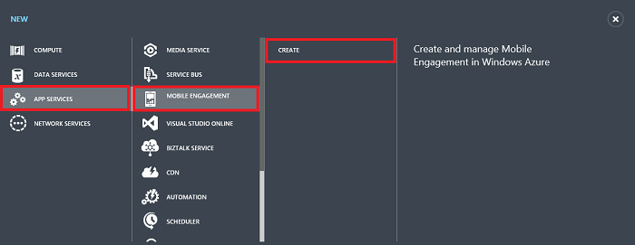

1. Iniciar sesión en el [Portal de Azure clásica](https://manage.windowsazure.com)y, a continuación, haga clic en **+ nuevo** en la parte inferior de la pantalla.

2. Haga clic en **Servicios de aplicación**, a continuación, **contratación móvil**y, a continuación, **crear**.

    

3. En el menú emergente que aparece, escriba la información siguiente:

    

    - **Nombre de la aplicación**: nombre de la aplicación. 
    - **Plataforma**: plataforma de la aplicación de destino. Debe crear una aplicación móvil compromiso por plataforma de destino de la aplicación móvil. 
    - **Nombre de recurso de aplicación**: nombre por el que será accesible a través de las direcciones URL y las API de esta aplicación. 
    - **Ubicación**: Centro de datos o región donde se va a hospedar esta aplicación y la colección de aplicación.
    - **Colección**: seleccione una colección creada anteriormente o 'nueva colección de'.
    - **Nombre de la colección**: representa el grupo de aplicaciones. Esto también garantizará que todas las aplicaciones están en un grupo que le permitirá agregados cálculos de métricas. Debe usar su nombre de la empresa o departamento aquí si procede.

4. Seleccione la aplicación que acaba de crear en la ficha **aplicaciones** .

5. Haga clic en **Información de conexión** para mostrar la configuración de conexión para poner en la integración del SDK en la aplicación móvil.

6. Copie la **Cadena de conexión** : Esto es lo necesita identificar esta aplicación en el código de la aplicación y conectarse con Mobile compromiso desde la aplicación.

    

