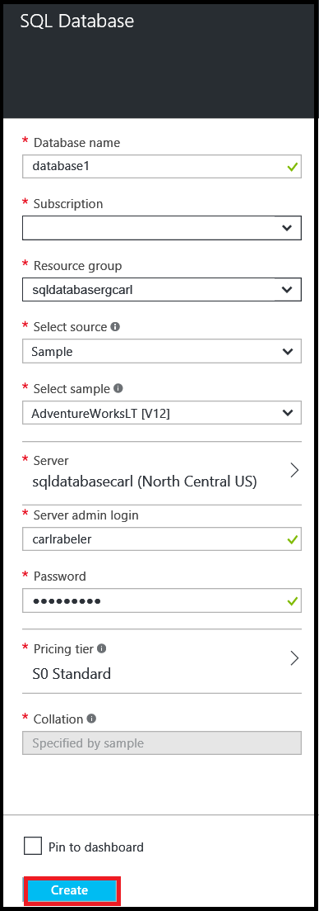

<!--
includes/sql-database-create-new-database-portal.md

Latest Freshness check:  2016-04-11 , carlrab.

As of circa 2016-04-11, the following topics might include this include:
articles/sql-database/sql-database-get-started-tutorial.md

-->
## Crear una nueva base de datos de SQL Azure

Realice los pasos siguientes en el portal de Azure para crear una nueva base de datos de SQL Azure en un servidor lógico de base de datos de SQL Azure nuevo o existente.

1. Si actualmente no está conectado, conecte el [portal de Azure](http://portal.azure.com).
2. Haga clic en **nuevo**, escriba la **Base de datos de SQL**y, a continuación, haga clic en **Base de datos de SQL (nueva base de datos)**.

     

3. Haga clic en **Base de datos de SQL (nueva base de datos)**.

     

4. Haga clic en **crear** para crear una nueva base de datos en el servicio de base de datos de SQL.

     

5. Proporcionar los valores de las siguientes propiedades del servidor:

 - Nombre de la base de datos
 - Suscripción: Esto se aplica solo si tiene varias suscripciones.
 - Grupo de recursos: si está comenzando a, utilice el grupo de recursos de servidor lógico.
 - Seleccione origen: puede elegir una base de datos en blanco, datos de ejemplo o una copia de seguridad de base de datos de Azure. Para migrar una base de datos de SQL Server local o cargar datos mediante la herramienta de línea de comandos BCP, consulte los vínculos al final de este artículo.
 - Servidor: Un servidor nuevo o existente lógico.
 - Inicio de sesión de administración de servidor
 - Contraseña
 - Nivel de precios: si está comenzando a, use el valor predeterminado S0.
 - Intercalación: Esto se aplica solo si se ha elegido una base de datos en blanco.

        

6.  Haga clic en **crear**. En el área de notificación, puede ver que ha iniciado la implementación.

     

7. Espere para que su implementación finalizar antes de continuar con el paso siguiente.

     
